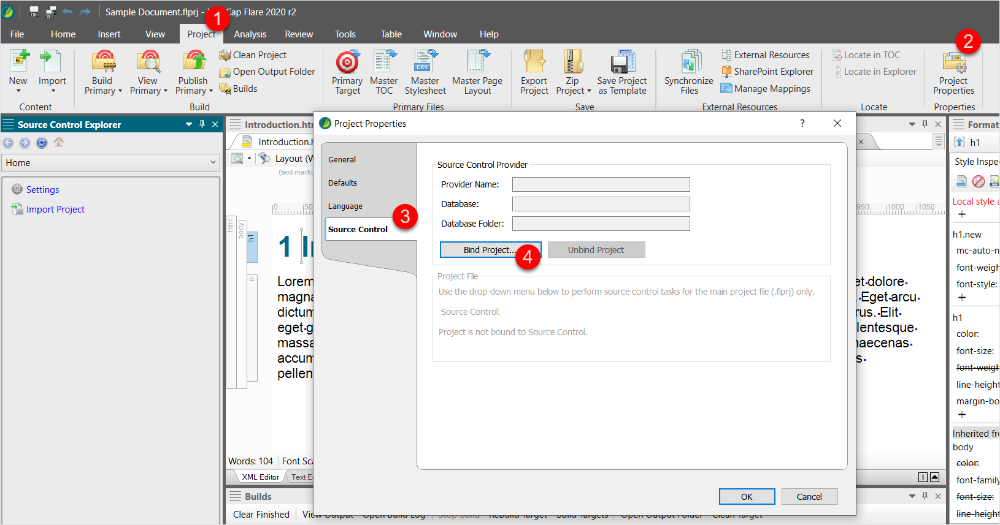
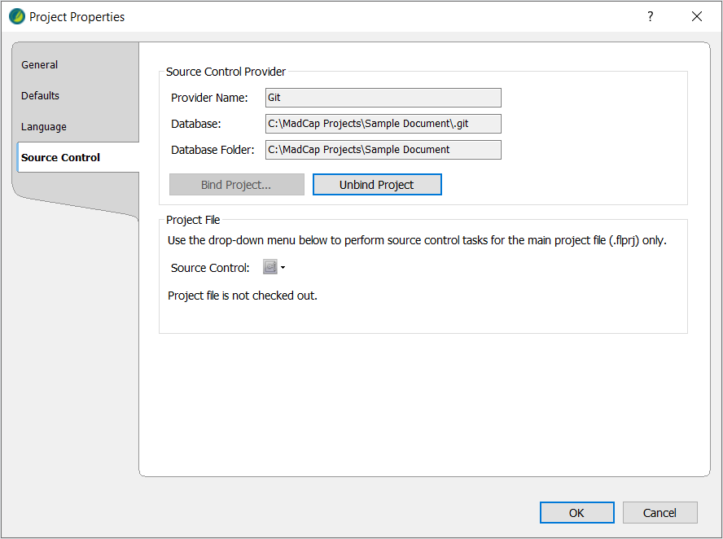
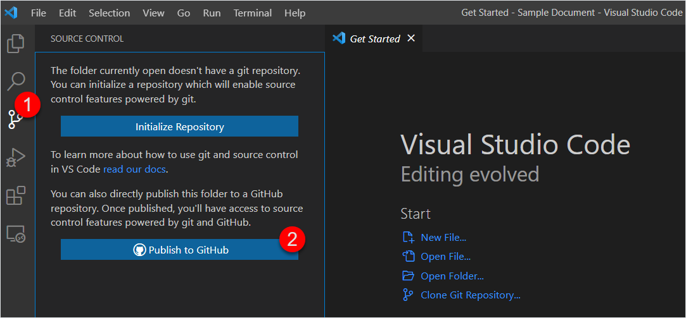
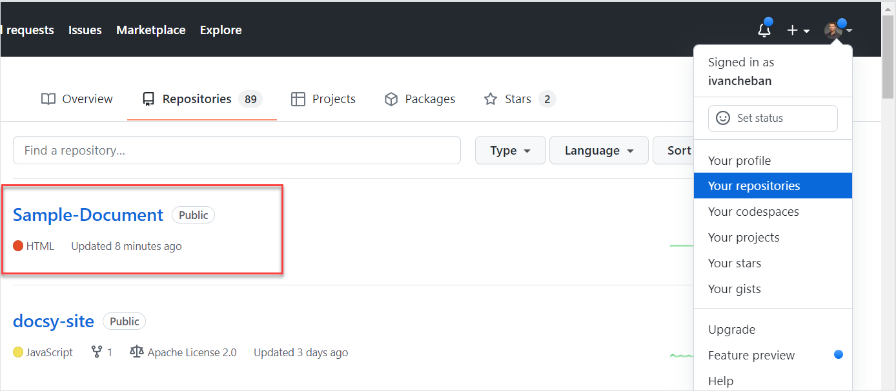
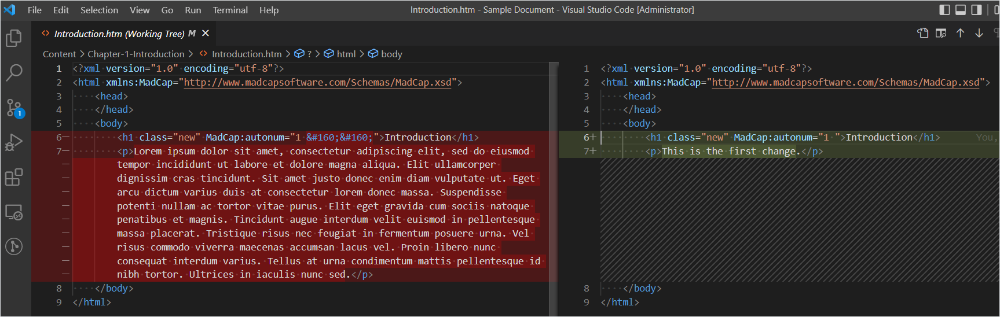
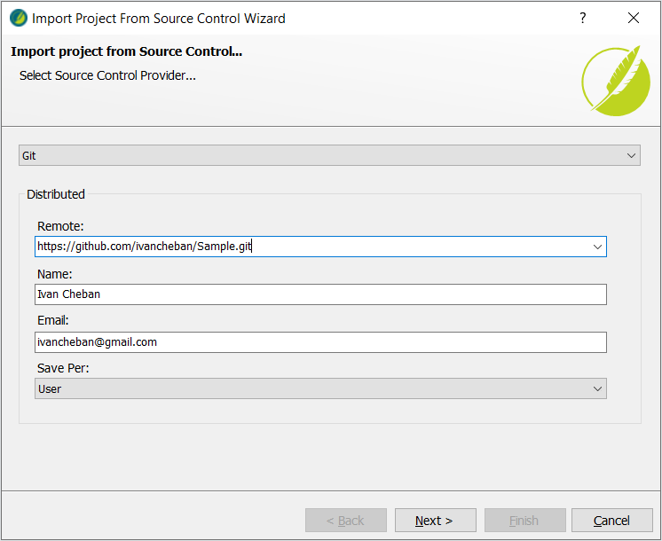
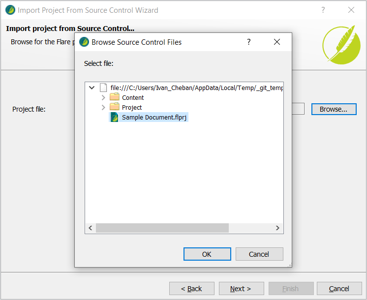
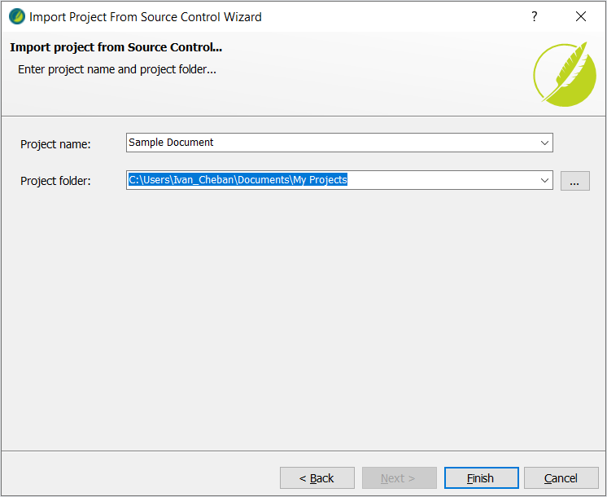

Our goal is to connect your MadCap Flare project to a repository in GitHub or GitLab. After connecting your project to Git, you will be able to commit all your changes to Git and sync this repository with any MadCap Flare project.

## Bind local MadCap project to GitHub

> In this scenario, you have a local MadCap Flare project on your computer. You want to bind this project to the repository in GitHub. Binding means connecting, uploading, or syncing the local files with the remote repository in the GitHub web interface.

### Bind using the Flare interface

To bind your MadCap Flare project to the GitHub repository:

1. Create a new (empty) GitHub repository.

    

2. Copy the link to your new and empty repository.

    

3. In your MadCap Flare, open **Project** > **Project Properties** > **Source Control** > **Bind Project**.

    

4. Select **Git** as your source control provider.

5. Select the **Remote Repository** checkbox.

6. Select the **Push on bind** checkbox.

7. Paste the link to your repository.

8. Enter your name, email address, and click OK.

    

9. Review the details of your bound project and click OK to close the menu.

    

Go to your GitHub repository and refresh the page to see the changes.

Your local project has been uploaded to your empty GitHub repository. Now you can change the local files in your MadCap project, commit the changes and push them to this remote repository.

### Upload your Madcap project to GitHub using VS Code

> You must have GitHub account and VS Code installed.

To connect your local MadCap project to a new GitHub repository in Visual Studio Code:

1. Open your Flare project folder in VS Code.

    

    

2. Select the Source Control tab from the side panel or click <kbd>Ctrl</kbd> + <kbd>Shift</kbd> + <kbd>G</kbd>.

3. Select **Publish to GitHub**.

    

4. Select **Publish to GitHub public repository** and click OK.

    

5. Select **Open on GitHub** in the bottom left corner of the screen.

    

You can go to your GitHub repositories and find your new repo.

Now, your local MadCap project is synced with this GitHub repository. You can use your VS Code to commit and push all your changes in this project.

If you want to use Flare's interface for Git operations, you need to bind it to a new repository as in [Bind using the Flare interface](#bind-using-the-flare-interface).

### Import an existing MadCap project from Git

To import an existing MadCap Flare project from the GitHub or GitLab repository:

1. Go to the GitHub or GitLab repository containing the MadCap Flare project you want to import.

    For example: https://github.com/ivancheban/Sample.

2. Copy the HTTPS link to this repository.

    For example: https://github.com/ivancheban/Sample.git

    

3. In MadCap Flare, select **File** > **New Project** > **Import From Source Control**.

    

4. Paste the HTTPS link to your GitHub or GitLab repository ending in .git and click Next.

    

5. Click Browse, select the MadCap Flare project file in the remote repository, and click OK.

    

6. Click Next and Finish.

    

As a result, your MadCap project from GitHub or GitLab is imported locally on your computer. This MadCap project is now bound or connected to your remote repository. You can start changing the files locally, committing and pushing the changes to the remote repository.

## Connect MadCap Flare project to Git

> This is the video on YouTube where I show how to connect your local MadCap Flare project to the GitHub repository.

<iframe width="560" height="315" src="https://www.youtube.com/embed/8TDqoyx_Wa8" frameborder="0" allow="accelerometer; autoplay; clipboard-write; encrypted-media; gyroscope; picture-in-picture" allowfullscreen></iframe>
